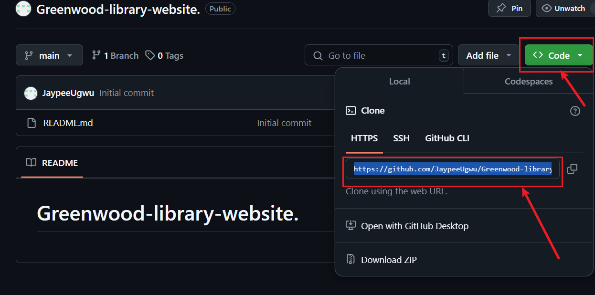
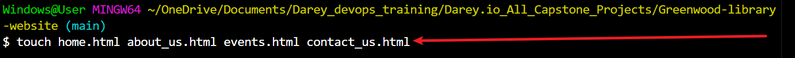
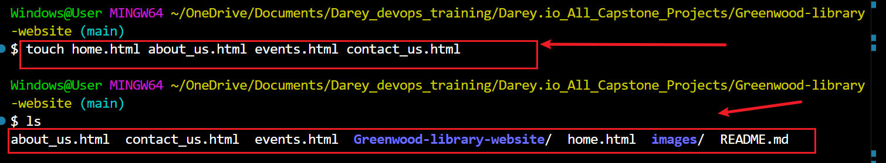
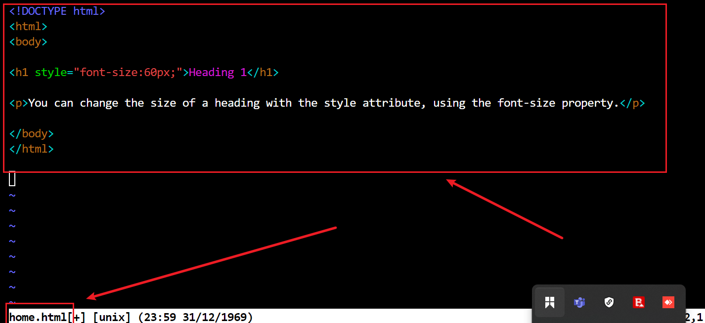
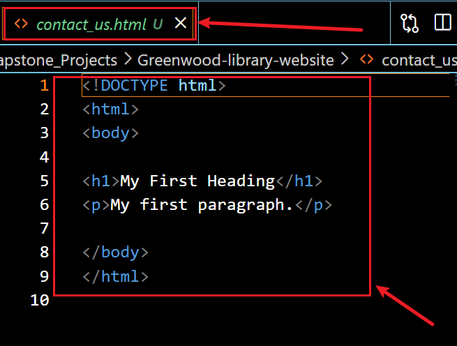
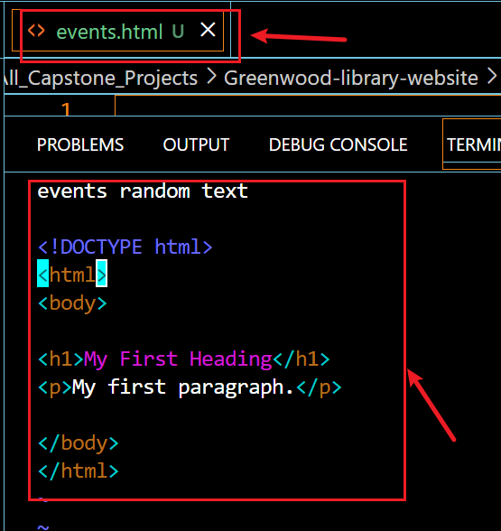
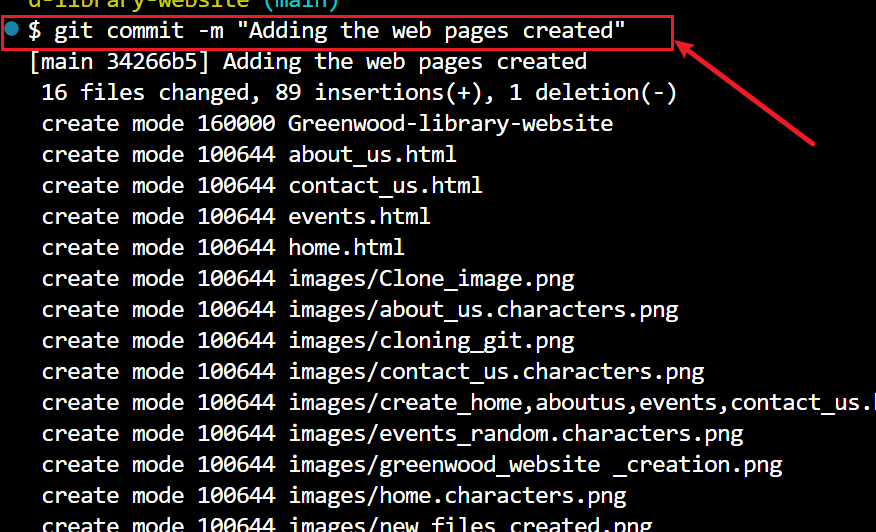
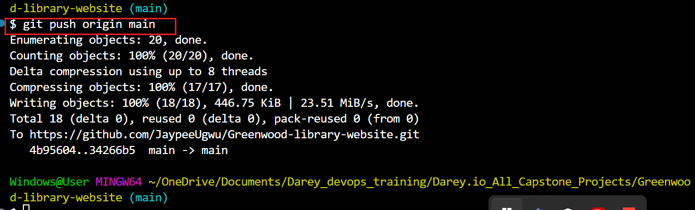
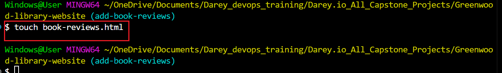

# CapStone Project: Enhancing a Community Library Website

**Background Scenario**

You're part of a development team tasked with enhancing the website for the "Greenwood Community Library." The website aims to be more engaging and informative for its visitors. It currently includes basic sections: Home, About Us, Events, and Contact Us. Your team decides to add a "Book Reviews" section and update the "Events" page to feature upcoming community events.
You will simulate the roles of two contributors: "Morgan" and "Jamie". Morgan will focus on adding the "Book Reviews" section, while Jamie will update the "Events" page with new community events.

## Setup

1. Create a new Repository on GitHub:

- Name it Greenwood-Library-Website.

- Initiate it with a README.md file.

- Clone it to your local machine:

# Tasks

### 1. In the main branch, using Visual Studio Code editor, ensure there are files for each of the web pages:

- home.html
- about_us.html
- events.html
- contact_us.html

### 2. Add any random content into each of the files
- Random content into home.html

- Random content into about_us.html

- Random content into contact_us.html

- Random content into events.html

3. Stage, commit, and push the changes directly to the main branch 

(This simulates the team's existing codebase for the website):

Steps:

git add .

git commit -m "Initial commit: 

Add new web pages created"

git push origin main

Morgan's Work: Adding Book Reviews

1. Create a branch for Morgan:

2. Add a new file *book_reviews.html* to represent the Book Reviews section:
	

    3. Add a random text content into the file

    

4. Stage, commit, and push changes:

- git add update_events.html
- git commit -m "Updating Event Page"
- git push origin update-events
